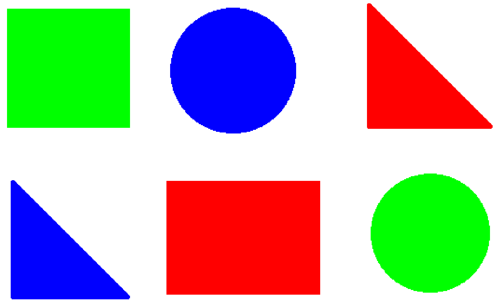

颜色识别 
======================================================

颜色识别是计算机视觉中的一项基础任务，旨在通过分析图像中的像素值来识别特定的颜色或颜色区域。颜色识别在图像处理、物体检测、跟踪、分类等场景中应用广泛。

Example: 识别红色 
++++++++++++++++++++++++++++++++++++++++++++++++++++++ 

:: 
    
    from maix import image, camera, display

    cam = camera.Camera(640, 480) # 摄像头初始化
    dis = display.Display()       # 显示屏初始化

    # 根据要识别的颜色选择
    thresholds = [[0, 80, 40, 80, 10, 80]]      # red
    # thresholds = [[0, 80, -120, -10, 0, 30]]    # green
    # thresholds = [[0, 80, 30, 100, -120, -60]]  # blue

    while 1:
        img = cam.read() # 获取图像
        blobs = img.find_blobs(thresholds, pixels_threshold=500) # 查找色块
        for blob in blobs: # 逐个画出框图
            img.draw_rect(blob[0], blob[1], blob[2], blob[3], image.COLOR_WHITE, thickness=3)
        dis.show(img) # 显示图像

 

 